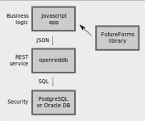

# FutureForms

FutureForms Javascript REST API library

FutureForms is a Typescript library for fast and easy development of data entry forms.

Turn a HTML table into a database view, search and edit form with a few edits.

Go to the [install section](#install-futureforms-featured-demo-and-tutorial-installation) .

## Stack

A normal Full-stack development consist of af front-end, a back-end and a database.
In FutureForms this is cut down to a front-end, a generic back-end and a database.

Here the sketch shows the Javascript application running in the client browser
and then sending SQL to the `openrestdb` back-end.
The `openrestdb` converts the SQL to the appropriate database driver
and sends the result back to the client.



In FutureForms all or mostly all of the business logic
is in the front-end.

Eventually some business logic is written in a
stored procedure in the database.

The back-end (web server) is a generic components so none of the
application code is written in here.


## Security

FutureForms is primarily ment to be used for intra-net.
SQL-statements are written in the Javascript application
and then passed through the back-end directly to the database.

It is therefore necessary to protect with `GRANT` and other
security technics.


`openrestdb` can be configured to reject known keywords like
`CREATE`, `DROP` and `TRUNCATE` but it recommended to handle
the security in the database with `GRANT`.

### Exploits of a Mom

In a standard full-stack setup you have the risk of a SQL-injection.
With FutureForms any SQL-statements are passed through even
the infamous `"Robert'); DROP TABLE Sudents"` so you have
to protect your database for this kind of statements.


© 2010 [xkcd.com](https://xkcd.com/327/) 


## Install FutureForms featured demo and tutorial installation


This Ansible script will install FutureForms with the extended demo.
This demo will show what a lot of the classes in FutureForms can do.

### Requirements

This script will install a lot of TypeScript package
so it is recommended to run the script in a Ubuntu
server running on a virtual machine (VirtualBox, LXC, VmWare, WSL).
This will make a cleanup easier.

In Ubuntu these packages and their dependencies will be installed:

* Java
* PostgreSQL
* npm
* node-typescript
* unzip

Make the installation easier by not requiring password all the time
add `NOPASSWD:` to the group `%sudo`.
Run the command `visudo`:

```
sudo visudo
```

Change the line with `%sudo` to:

```
%sudo   ALL=(ALL:ALL) NOPASSWD:ALL
```

### Install

Start Ubuntu and install Ansible and Git yourself:

```
sudo apt install ansible
```

Now you are ready to install 
[FutureForms Featured Demo](playbooks/demo/)
with the ansible script.

If you want to develop yourself you should start from the tutorial list:

* [hello1](playbooks/hello1) Anonymous login
* [hello2](playbooks/hello2) Username login
* [hello3](playbooks/hello3) One table
* [hello4](playbooks/hello4) Sort column
* [hello5](playbooks/hello5) Join two tables - master/detail
