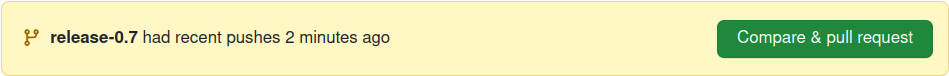
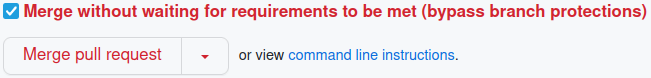
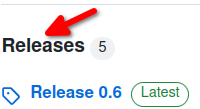
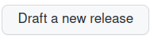
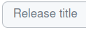
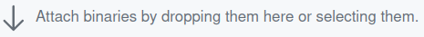
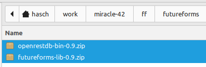
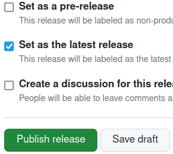

# Release procedure

When the development has come to a new state where it is time for a new
release, these tasks will be done:

* Branch from development trunk
* Create a 'release branch'
* Bump version number
* Edit ChangeLog
* Fix last minute changes
* Push 'release branch' and test thoroughly 
* Checkout 'main'
* Merge 'dev'
* Push 'main'
* Pack binaries
* On GitHub
  - Release: 'Draft a new release'
  - Add new tag version
  - Add binaries
  - Release
* On local, pull Github
* Branch to 'dev'
* Merge 'release branch'
* Delete 'release branch'
* Push 'dev'

## Release tasks

Run the following commands on your local command line.

Set environment variable `NEWREL` to the new version number
so copy/paste can be used.
Example:

    export NEWREL=1.2.3

Get last minut changes

    git pull

If you have any changes which should be added do that

    git commit -a
    git push

Create a release branch which can be shared with other testers

    git checkout -b candidate-$NEWREL latest

Bump version with a script and an editor

    ./util/set-version.sh $NEWREL
    vi ChangeLog.md

Clean up up old build files

    ansible-playbook playbooks/remove-build-files.yml

Run release playbook

    ansible-playbook playbooks/release/release.yml 

Pack the binaries with pre-compiled libraries

    git add -f download/*.zip

Publish the release branch to other testers

    git commit -a -m "Bumped version number to $NEWREL"

If someone should test this release candidate, it can
be pushed.

    git push --set-upstream origin candidate-$NEWREL

Now the release is finished and can be merged in to
`main` and `dev`.
Tag `main` so it can be checked out agian.

    git checkout main
    git merge --no-ff candidate-$NEWREL

Merge the last minute changes back into `dev`.

    git checkout dev
    git merge --no-ff candidate-$NEWREL

The release is now finished and the branch can be deleted.

    git branch -d candidate-$NEWREL

Make a pull in case the developers has added more code.

    git pull

Publish the release.

    git push

Go to Github and tag the new release.

    firefox https://github.com/miracle-42/futureforms

The new release is presented. Compare & pull request.

Click "Create pull request".

Click "Merge pull request".

Go to project front page and click "Release" in the right side.

Click "Draft a new release" in the right side.

Click "Choose a tag" in the left side.

Type a new tag in "Find or create a new tag".

Type the new release name i.e. "v0.7".

Write release title i.e. "Release v0.7".

Click attach binaries and select files.

At the buttom click "Save draft" and "Publish release".

New release completed.
Announce by e-mail.
