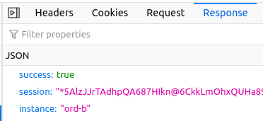

# Web Proxy

In a production environment where FutureForms should be
integrated with other services,
a proxy is useful.
A proxy can be made with Nginx or Apache.

In this example two backends are running with port numbers
9002 and 9012.

If a request goes to `https://example.org/s0`
it will be proxied to the service on port 9002.
Request to `https://example.org/s1` goes to port 9012.

In the `proxy_pass` statement an ending `/` is needed
to strip off the `/s0/` path before it is send to the backend.

Also in Typescript `FormsModule.ts` the `/s0` is added by making the
`Connection()` have the path set with `documentURI`:

    FormsModule.DATABASE = new Connection(document.documentURI.match(/^.*\//)[0]);

`documentURI()` will return `https://example.org/s0/index.html`
and then `match` will strip it to `https://example.org/s0/` 
with a regular expression. 
`[0]` will return the first element in the array from `match`.

In case the backend is not running error code `502 Bad Gateway` will be shown.
In this example a more informative page
`/var/www/html/example.org/errcode/502.html`
is shown.

If there is a reverse proxy in front of Nginx it might be necessary to
add a trailing slash `/` to the path. If the location is `/foo` the file
`/foo/index.html` get's loaded but afterwards `/foo/` should be prefixed so
`/foo/demo.js` get's loaded. The prefix is missing so the browser tries to
load `/demo.js` which does'nt exists. This can be fixed by changing `/foo`
to either `/foo/` or simply `/foo/index.html` which is the file which is
suppoesed to be loaded.

Use this redirect:

    rewrite ^(/[^/]+)$ $1/ permanent;

or

    rewrite ^(/[^/]+)$ $1/index.html permanent;

Here a full Nginx example:

    server {
        listen 443 ssl;
        #listen [::]:443 ssl;
        server_name example.org;
        root /var/www/html/example.org;
        access_log /var/log/nginx/example.org/access.log combined;
        error_log /var/log/nginx/example.org/error.log;
        index index.html;
        gzip on;
        gzip_static on;
    
        ssl_certificate /root/.acme.sh/example.org_ecc/fullchain.cer;
        ssl_certificate_key /root/.acme.sh/example.org_ecc/example.org.key;
    
        error_page 502 /errcode/502.html;
        location /errcode { }
    
        location /s0 {
            proxy_pass_header Set-Cookie;
            proxy_cookie_path / "/; secure; HttpOnly; SameSite=strict";
            rewrite ^(/[^/]+)$ $1/ permanent; # If more than one proxy is used add this rewrite
            proxy_pass http://127.0.0.1:9002/; # Need trailing slash '/'
        }
        location /s1 {
            proxy_pass http://127.0.0.1:9012/;
        }

        location / {
            proxy_pass http://127.0.0.1:9002; # Ending '/' not needed
        }
    }

## Load balancing

To configure and maintain a load balancing setup is more complex than
a single setup. So if not required keep it simple.

Load balancing setup:

    upstream lbopenrestdb {
	server ordb7.example.com:9022;
	server ordb8.example.com:9032;
    }

    server {
    ...
        location /loadbalance {
            rewrite ^(/[^/]+)$ $1/ permanent; # If more than one proxy is used add this line
            proxy_pass http://lbopenrestdb/; # Need trailing '/'
        }
    }

When having multiple OpenRestDb they should be configured to be unique identified
by the tree parameters: Hostname, Port number and Instance.

The instance name and port number are configured in `conf/config.json`:

    {
      "instance": "ord-a",
      ...
      "http": {
        "ports": {
          "plain": 9002,
      ...
    }

Nginx can make a reverse proxy to either instances
on the same server or instances on other serveres 
on the net.

Two OpenRestDb on the same server.
Port and instance name has to be unique.
The application can be upgraded without downtime.
OS upgrade will result in downtime.

| App   | Hostname  | Port | Instance |
| ----- | --------- | ---- | -------- |
| App-1 | localhost | 9002 | ord-a    |
| App-2 | localhost | 9012 | ord-b    |

Two servers with each one or more OpenRestDb instances.
Instance name could be the same on each different host 
but it is recommended to give them global unique
names to identify them for debug in the browser.

| App   | Hostname  | Port | Instance |
| ----- | --------- | ---- | -------- |
| App-1 | webserv-1 | 9002 | ord-a    |
| App-2 | webserv-2 | 9002 | ord-b    |
| App-3 | webserv-2 | 9012 | ord-c    |

The instance name can be seen in Firefox by going to 
the *hamburger button* ☰ in upper right corner ⮕  More Tools ⮕ Web Developer Tools 
⮕ Network (tab sheet) ⮕ Responce:

