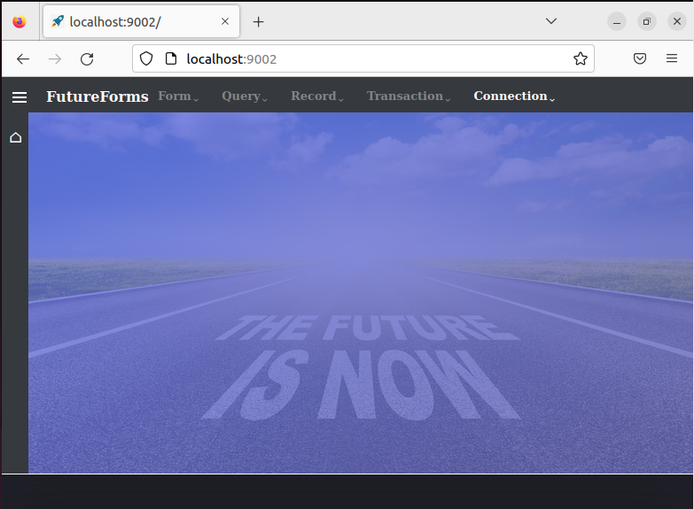
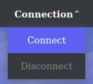
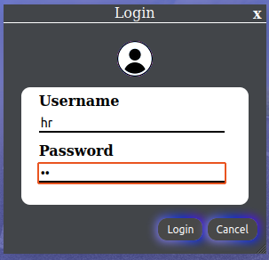
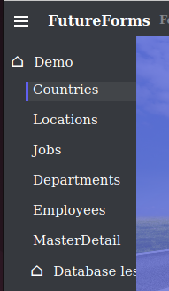
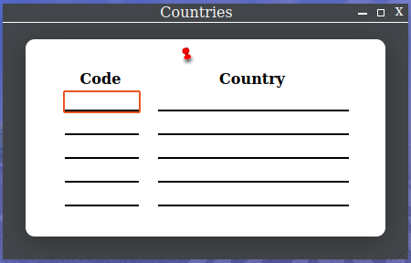
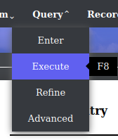
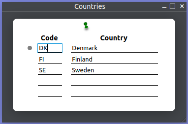
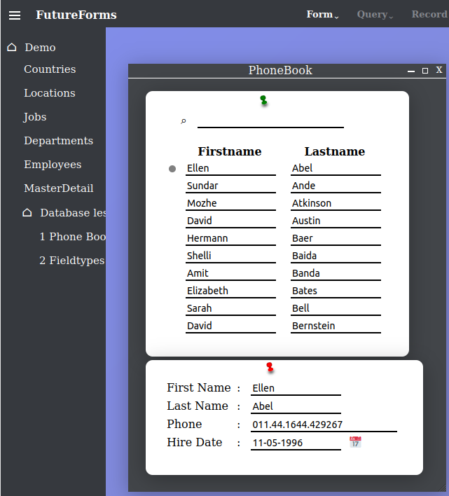
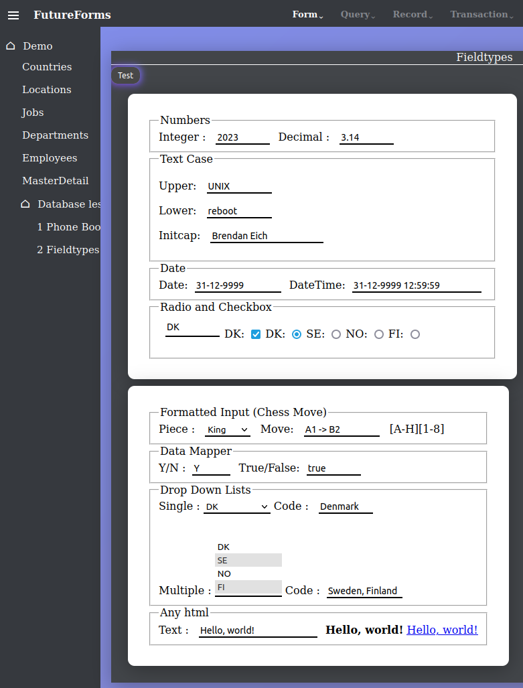

# FutureForms featured demo installation

This Ansible script will install FutureForms with the extended demo.
This demo will show what a lot of the classes in FutureForms can do.

## Requirements

Read the requirements at the [frontpage](../../README.md).

## Clone repository

Then clone this repository.

```
git clone https://github.com/miracle-42/futureforms futureforms
cd futureforms
```

## Configure

In the top of [install-demo.yml](install-demo.yml) the
following changes might be required.

The `install_path` is set to `build` in the cloned directory.
This is where the installation will be located.

## Install

Run the `install-demo.yml` playbook:

```
ansible-playbook playbooks/demo/install-demo.yml 
```

The installation, download and compilation takes about 3 minutes
and will take up about 1.1GB disk space.

## Start openrestdb

`openrestdb` is a Java program which is the actual web server.
Go to the directory and start the webserver:

```
cd build/openrestdb.demo/
bin/openrestdb start
```

Now the web service is running on port 9002
and can be seen at http://127.0.0.1:9002/

Now the frontscreen can be seen.



Click `Connection` in the menu bar and then `Connect`.



Enter demo user `hr`and demo password `hr` to login to the database.



Click the *hamburger button* ☰ in upper left corner and then `Countries`



The empty Countries table is now shown.



Click `Query` and `Execute` in the top menu or press the key `F8`.



Now the table is filled with data from the database.



---

## Database less

FutureForms also supports forms without a connection to a database.

### Phone Book



The *Phone Book* is an example of a hard coded in memory list
with a relational master/detail.

### Field Types



Field input can be limited and validated.

#### Numbers

**Integer**

Only numbers 0 to 9 can be entered.
First digit can only be 0 if the whole number is 0.

**Decimal**

Enter integer og decimal numbers.
Only one dot '.' can be entered.
Comma or other decimals delimiters are not allowed.
Only two decimals.

#### Text Case

**Upper**

Text entered will be converted to upper case.

**Lower**

Text entered will be converted to lower case.

**Initcap**

First letter in each word entered will be converted to upper case
and the rest to lower case.

#### Date

**Date**

Date can only be entered in the format 'DD-MM-YYYY'.

**DateTime**

Date and time can only be entered in the format 'DD-MM-YYYY hh:MM:SS'.

#### Radio and CheckBox

Radio and checkboxes can be selected by typing the value 
or clicking the circle or box.

#### Formatted input

Select a drop-down
and limit/validate 'move' with regular expression.

#### Data Mapper

Enter 'y' or 'n' and map to another field.

#### Drop Down Lists

Select one item from a list and get long name in another field.

Select multiple items from a list with Shift and Control key.

#### Any html

Any text entered displayed in another field.
